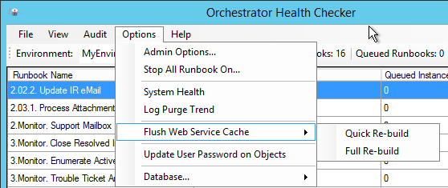

As you create and publish Runbooks in SMA, some of these may require to execute runbooks which are hosted on Orchestrator. Over time these might all be working just as expected, however; one day out of the blue your latest masterpiece of Orchestration and Workflows may decide to turn evil and start failing with no logical explanation evident…

The only tell tail sign is visible in the history log for the Workflow which is failing, with this real ugly message appearing


The source of this error is the SMA command **Get-OrchestratorRunbook **which in our workflow would be defined as similar to line 28 in the sample below.


So, what is the issue? All the parameter's are correct –


  * **$url** – points to the correct location in Orchestrator ODATA Web Services


  * **$PSUserCred** – references real credentials with access to the Orchestrator ODATA Web Services


  * **$MyRunbookPath** – is the correct path to our target runbook


Everything checks out; we have many more runbooks hosted on the same Orchestrator environment, all working fine, and to make things worse; many of them are also been successfully called from SMA at this time…


## Investigation


We being the diagnostics looking at the error log as shown above, but sadly it really does not offer a lot of details, cryptic to be honest. So we need to figure out what is happening at this call, which results in the error.

To assist, we will create a function of our own, to simulate what this SMA function is trying to do, so that we can get a View into the workings of this issue.

The function will attempt to establish a connection with the ODATA service, then search for our runbook; once located the runbook will then be checked to see if we have parameters defined on the runbook; In the case where the runbook is not located, we will be informed that this is the case also.

Calling this function is also very simple, and similar to the code we use in SMA (on purpose); passing in parameters including the location of the Orchestrator ODATA URL, credentials to authenticate with the service, and the name of the runbook which we are interested in.

As an example, let's consider the query of an older runbook which is working fine at the moment.

```powershell
PS> $myCreds = Get-Credential
PS> Get-OrchestratorRunbook -RunbookName "3.1.1. My Original Runbook" -Server "api.orchestrator.diginerve.net" -Credentials $myCreds

8204a38b-fdc9-4381-9368-8da459bb793d (\3. Management\3.1. Workitems\3.1.1. My Original Runbook)
c8a4550b-2328-4fae-9241-321ca17e3ab6 (Mode)
03637ac2-a875-4555-a300-93af698c4602 (WorkItemID)
```

From the output of this command, we can quickly see that the runbook is located, and it had two parameters detected.

Now, lets try this again, this time using the name of the runbook which is giving us trouble from SMA.

```powershell    
PS> Get-OrchestratorRunbook -RunbookName "3.1.2. My New Runbook" -Server "api.orchestrator.diginerve.net" -Credentials $myCreds

Runbook Not Found
```


As you can see, the results are unexpected, with the function reporting that our runbook is not found… So at this point, we go back, triple check the runbook name in orchestrator, its permissions and in general that everything looks correct.

Once satisfied, we can retest, and hopefully get the details of our runbook. But, technology been technology – we know that its not going to be so simple, after all SMA has been failing on this runbook consistently, so we really have a reproduction of the problem with our test.


## Deduction


With the data to confirm that our runbook is indeed created, named, published and delegated we know that the work in orchestrator is done correctly.

Similarly, in SMA we know that it is also not broken, in this case we have confirmed the error message which is reported is indeed valid, as the ODATA interface is not exposing our runbook.


## Solution


With the issue clearly on the Orchestrator ODATA service, what we are experiencing here is a known issue with this web service, where it can fail to keep up-to-date with all the runbooks which are registered in our environment. To resolve this, we have some options, but the simplest and fastest method is to use the Orchestrator Health Checker.

NOTE: I have posted details on this tool – [Install and Configure the Health Checker](http://www.petri.com/monitor-system-center-2012-orchestrator-health-checker.htm), followed by a post on [Using the Health Checker](http://www.petri.com/use-orchestrator-health-checker-troubleshoot-runbooks.htm)
_

From the **Options **menu, we simple need to select the option **Flush Web Service Cache **and then select the appropriate option for rebuilding the ODATA endpoint, personally I will select **Full Re-build. **This will take a few moments depending on the size and complexity of our Orchestrator environment; but once complete a popup will be presented to confirm the action is done.



Now, finally, we can loop back and run our test function again. Assuming everything has worked out, we should now be able to locate the runbook, and expose its parameter's

```powershell    
PS> Get-OrchestratorRunbook -RunbookName "3.1.2. My New Runbook" -Server "api.orchestrator.diginerve.net" -Credentials $myCreds

39314a8d-c89f-4fe0-adf9-3aade8ed7286 (\3. Management\3.1. Workitems\3.1.1. My New Runbook)
130e7f87-d08f-4201-b912-953459828b69 (WorkItemID)
```    


With this now working, we can finally loop back to SMA, and validate the workflow is working correctly.
